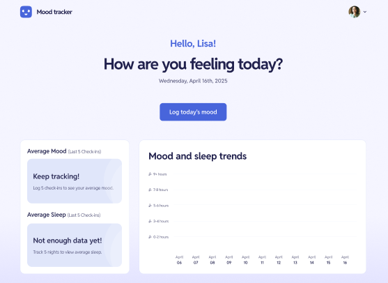

# Mood Tracking App

🚧 **Em desenvolvimento**  
Este projeto está em construção e ainda está sendo aprimorado. Atualmente, trata-se de uma aplicação **apenas com front-end**, sem funcionalidades de back-end implementadas.

---

## 📝 Descrição

O **Mood Tracker** é uma interface criada com o objetivo de acompanhar e visualizar o humor diário de forma simples, leve e amigável.

A proposta do design é permitir que o usuário registre seus sentimentos, visualize tendências e tenha uma visão geral do seu bem-estar emocional ao longo do tempo.  
Atualmente, a aplicação está focada apenas no **desenvolvimento da interface visual** (UI), sem conexão com banco de dados ou funcionalidades dinâmicas.

---

## 🎯 Objetivo do Projeto

O projeto tem como finalidade o **aperfeiçoamento de habilidades em front-end**, com foco em:

- Componentização e estrutura de layout
- Design limpo e intuitivo com foco em UI|UX
- Representação visual de dados com gráficos e indicadores
- Boas práticas de HTML, CSS e JavaScript puro

---

## 💻 Tecnologias Utilizadas

- **HTML5**
- **CSS3**
- **JavaScript**

---

## 📌 Status

- [x] Estrutura visual das telas principais
- [ ] Responsividade para dispositivos móveis
- [x] Adição de interações básicas (ex: exibir dados fictícios dinamicamente)

---

## 📚 Funcionalidades (somente visuais até o momento)

- Tela de boas-vindas com saudação personalizada
- Registro visual do humor diário
- Gráfico representando padrões de humor e sono
- Interface para preenchimento de humor do dia

---

## 🚀 Possibilidades futuras (não previstas no momento)

Apesar de inicialmente planejado como uma aplicação completa, o projeto **permanecerá como front-end** para fins de portfólio. Possíveis implementações como back-end, login, banco de dados e relatórios foram descontinuadas por enquanto.

---

.png)
.png)

